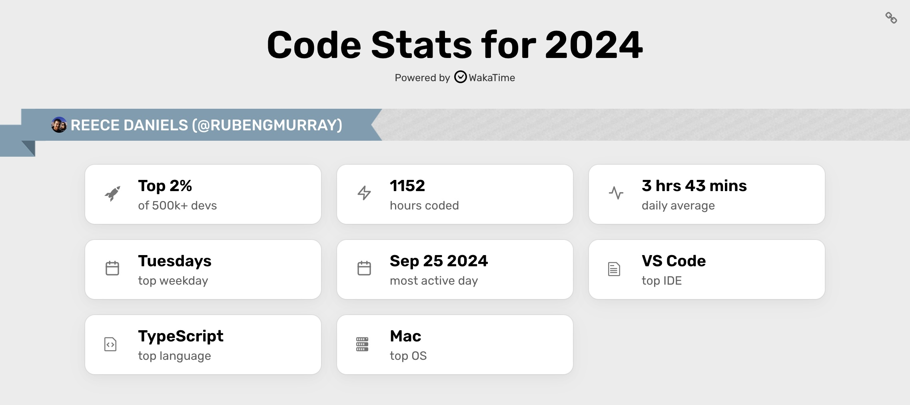

# Hi :wave:

I'm Reece (aka rubengmurray).

I'm Head of Backend Engineering at <a href="https://kwiff.com?ref=github.com/rubengmurray" target="_blank">`kwiff`</a> where we aim to drive innovation in online sports ⚽ & casino betting 🎰.

In my spare time I enjoy creating my own projects and contributing to the open-source community - including maintaining the npm packages <a href="https://npmjs.com/knex" target="_blank">`knex`</a> & <a href="https://npmjs.com/chrome-cookies-secure" target="_blank">`chrome-cookies-secure`</a>.

 - 
 -

## Project List
<ul>
  <li><a href="https://reecedaniels.com" target="_blank">Reece Daniels</a>: Personal Site</li>
  <li><a href="https://illalbumati-vercel.vercel.app" target="_blank">Illalbumati</a>: Spotify Playlist Visualiser</li>
  <li><a href="https://github.com/bertrandom/chrome-cookies-secure" target="_blank">chrome-cookies-secure</a>: Extract cookies from local browser profiles</li>
  <li><a href="https://rubengmurray.github.io/mortgage-calculator" target="_blank">Mortgage Calculator</a>: Calculate impact of over-payments on your mortgage</li>
  <li><a href="https://taxinfo.uk" target="_blank">UK Tax Calculator</a>: Check take-home salary, pension contributions for UK salaries</li>
  <!-- <li><a href="https://leaderboard.tfehq.net" target="_blank">Task Force Elite Leaderboard</a>: Leaderboard for the online FPS Task Force Elite</li> -->
  <li><a href="https://technosnake.s3.eu-west-2.amazonaws.com/index.html" target="_blank">Techno Snake</a>: Techno remix of the classic snake game from the Nokia 3310 era</li>
  <li><a href="https://github.com/RedSpearStudios/discord-bot" target="_blank">'Players Online' Discord Bot</a>: Shows players online for a steam game in your discord server</li>
</ul>

## Stats

<!--  -->

<!-- **rubengmurray/rubengmurray** is a ✨ _special_ ✨ repository because its `README.md` (this file) appears on your GitHub profile. -->

### Wakatime 

<!-- 2024 not working the same way as previous years -->

  
Previous Years

  
  

 

### Badges

<!--  -->

